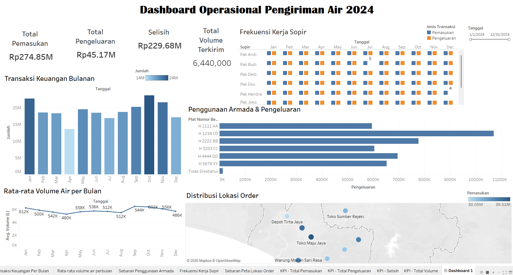

# 🚚 Dashboard Operasional Pengiriman Air 2024

Dashboard interaktif berbasis **Tableau** untuk memantau kinerja operasional perusahaan pengiriman air, mencakup arus keuangan, produktivitas sopir, penggunaan armada, hingga sebaran lokasi pelanggan sepanjang tahun 2024.

## 📌 Latar Belakang

Proyek ini dibuat sebagai tugas mata kuliah **Visualisasi Data**, dengan tujuan mengubah data transaksi dan operasional pengiriman air mentah menjadi dashboard yang informatif dan mudah dibaca, sehingga dapat mendukung pengambilan keputusan terkait keuangan, efisiensi armada, dan penjadwalan sopir.

## 🎯 Tujuan

- Memantau **arus kas** (pemasukan, pengeluaran, dan selisih) secara bulanan.
- Menganalisis **produktivitas sopir** berdasarkan frekuensi kerja dan jenis transaksi.
- Mengevaluasi **penggunaan armada** (plat nomor kendaraan) terhadap total pengeluaran operasional.
- Memetakan **sebaran lokasi order** pelanggan untuk melihat pola distribusi wilayah pengiriman.
- Melihat **tren rata-rata volume air** yang terkirim setiap bulan.

## 🧩 Fitur Dashboard

| Komponen | Deskripsi |
|---|---|
| **KPI Cards** | Total Pemasukan, Total Pengeluaran, Selisih, dan Total Volume Terkirim sepanjang 2024 |
| **Transaksi Keuangan Bulanan** | Grafik batang perbandingan nilai transaksi tiap bulan |
| **Rata-rata Volume Air per Bulan** | Grafik garis tren volume air (liter) yang dikirim tiap bulan |
| **Frekuensi Kerja Sopir** | Heatmap kalender per sopir, dipisah berdasarkan jenis transaksi (Pemasukan/Pengeluaran) |
| **Penggunaan Armada & Pengeluaran** | Grafik batang horizontal pengeluaran per plat nomor kendaraan |
| **Distribusi Lokasi Order** | Peta interaktif titik lokasi pelanggan, diberi gradasi warna berdasarkan nilai pemasukan |
| **Filter Tanggal** | Slicer rentang tanggal untuk menyaring seluruh visual secara dinamis |

## 🛠️ Tools & Teknologi

- **Tableau Desktop** — pembuatan dan desain dashboard
- **Power Query** — pembersihan dan transformasi data
- **DAX** — perhitungan measure (Total Pemasukan, Selisih, Rata-rata Volume, dll.)
- **Mapbox / OpenStreetMap** — visualisasi peta lokasi order

## 📊 Sumber Data

Data operasional pengiriman air (transaksi keuangan, jadwal sopir, penggunaan kendaraan, dan lokasi order) tahun 2024. *Data yang ditampilkan telah dianonimkan/disamarkan untuk keperluan publikasi.*

## Kontak
Synthia Wulandari — [synthiawln@gmail.com](mailto:synthiawln@gmail.com) · [LinkedIn](https://www.linkedin.com/in/synthia-wulandari)
